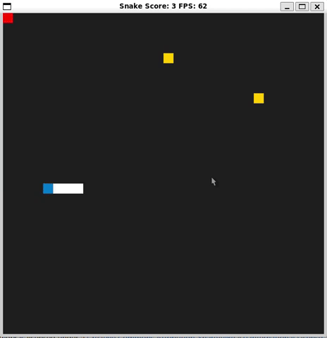

# Modified Snake Game

This is a starter repo for the Capstone project in the [Udacity C++ Nanodegree Program](https://www.udacity.com/course/c-plus-plus-nanodegree--nd213). The code for this repo was inspired by [this](https://codereview.stackexchange.com/questions/212296/snake-game-in-c-with-sdl) excellent StackOverflow post and set of responses.

Snake initially starts with length 1 and higher speed and gradually speed keeps decreasing as the snake length increases. This helps to increase the user confidence to play the game and player doesn't feel frustrated/anxious. Instead, at the end of the game the player feels an emotion of accomplishment. There is threshold to the lowest snake speed (0.15). It is done to keep the game interesting.
To make the game a bit more challenging I have introduced Difficulty levels Easy/Normal/Hard. User needs to avoid Poison, Wall and should try to eat the food.
Bonus food has been added whenever the snake length increases by a factor of 8/16/24/..., bonus food appears for 10 seconds. Eating bonus food will reduce the snake speed.

## Added Game features:
1. Introduced **Difficulty levels** (Easy/Normal/Hard).
   **Easy**: No poison, **Normal**: Poison, **Hard**: Poison + Wall
3. **PAUSE**: Game pauses on "ESC" and resumes on "Enter" key press
4. **Healthy food (Yellow)** for Snake to eat: Eating Yellow food increases the length and reduces the Snake speed.
5. **Poison (Red )**: Eating Red food will kill the snake. User needs to avoid the Red food.
6. **Bonus Food (Purple food)**: Eating Bonus food will decrease the snake speed.
7. **Wall**: If snake hits the wall, it will die.
8. **Highest Score:** Keeps track of the highest score and UserName to the file (/src/highest.txt) and is displayed at the end of the game.

## Dependencies for Running Locally
* cmake >= 3.7
  * All OSes: [click here for installation instructions](https://cmake.org/install/)
* make >= 4.1 (Linux, Mac), 3.81 (Windows)
  * Linux: make is installed by default on most Linux distros
  * Mac: [install Xcode command line tools to get make](https://developer.apple.com/xcode/features/)
  * Windows: [Click here for installation instructions](http://gnuwin32.sourceforge.net/packages/make.htm)
* SDL2 >= 2.0
  * All installation instructions can be found [here](https://wiki.libsdl.org/Installation)
  >Note that for Linux, an `apt` or `apt-get` installation is preferred to building from source.
* SDL2TTF >= 2.0
  * Linux: sudo apt install libsdl2-ttf-dev
* gcc/g++ >= 5.4
  * Linux: gcc / g++ is installed by default on most Linux distros
  * Mac: same deal as make - [install Xcode command line tools](https://developer.apple.com/xcode/features/)
  * Windows: recommend using [MinGW](http://www.mingw.org/)

## Basic Build Instructions

1. Clone this repo.
2. Make a build directory in the top level directory: `mkdir build && cd build`
3. Compile: `cmake .. && make`
4. Run it: `./SnakeGame`.
   
## Addressed rubric points
### Loop, Functions, I/O:
| Criteria                                                                                       | Explanation and link(s)                                                       |
|------------------------------------------------------------------------------------------------|-------------------------------------------------------------------------------|
| The project demonstrates an understanding of C++ functions and control structures.             | The whole project is organized with proper use of functions and flow of data. |
| The project reads data from a file and process the data, or the program writes data to a file. | Reads the user name at the console and from the input filestream. https://github.com/kashi-iiitb/CppND-Capstone-Snake-Game/blob/2c23394d9f020a1943c878c92177829db38812c2/src/main.cpp#L26 |
| The project accepts user input and processes the input.                                        | stores the user name and score to the file if score is highest https://github.com/kashi-iiitb/CppND-Capstone-Snake-Game/blob/2c23394d9f020a1943c878c92177829db38812c2/src/main.cpp#L45 |

### Object Oriented Programming:
| Criteria                                                                         | Explanation and link(s)                                                                                                                                                                                                                           |
|----------------------------------------------------------------------------------|---------------------------------------------------------------------------------------------------------------------------------------------------------------------------------------------------------------------------------------------------|
| The project uses Object Oriented Programming techniques.                         | Per the project structure the code uses 4 classes : `Snake`, `Game`, `Controller` and `Renderer`. All the data and the control logic is encapsulated in them.                                                                                     |
| Classes use appropriate access specifiers for class members.                     | All class data members are explicitly specified as public, protected, or private.|
|Member data that is subject to an invariant is hidden from the user and accessed via member methods.| For example 'std::vector<SDL_Point> foods' and the function which operates on it 'void PlaceSpeedInc(SDL_Point &speed_inc);' is added as private member. https://github.com/kashi-iiitb/CppND-Capstone-Snake-Game/blob/2c23394d9f020a1943c878c92177829db38812c2/src/game.h#L21 |
| Class constructors utilize member initialization lists.                          | Renderer, Game and Snake constructors use initialization lists. For example Snake constructor: https://github.com/kashi-iiitb/CppND-Capstone-Snake-Game/blob/2c23394d9f020a1943c878c92177829db38812c2/src/snake.h#L11|
| Classes abstract implementation details from their interfaces.                   | The operations/methods which can be applied on Object of the class are declared with public access specifier and operations/methods used internal to the object are declared with private access specifiers in all the classes - Snake, Game, Renderer and Controller.|

### Memory Management:
| Criteria                                                                                  | Explanation and link(s)                                                                                        |
|-------------------------------------------------------------------------------------------|----------------------------------------------------------------------------------------------------------------|
| The project makes use of references in function declarations.                             | Snake object is passed by reference in https://github.com/kashi-iiitb/CppND-Capstone-Snake-Game/blob/2c23394d9f020a1943c878c92177829db38812c2/src/controller.cpp#L12|
| The project uses destructor(s) appropriately.                                             | Renderer destructor destroys sdl_window. |
| The project uses scope / Resource Acquisition Is Initialization (RAII) where appropriate. | Snake object when created in Game() constructor is initialized at the same time |

### Concurrency:
| Criteria                                                                                  | Explanation and link(s)                                                                                        |
|-------------------------------------------------------------------------------------------|----------------------------------------------------------------------------------------------------------------|
| The project uses multithreading.                            | Bonus food time tracking is done in a seperate thread https://github.com/kashi-iiitb/CppND-Capstone-Snake-Game/blob/6dd1ad00830ba0805f45187c9cdb32097ab7e65a/src/game.cpp#L206|
| A mutex or lock is used in the project. | Flag for bonus food active is protected with mutex https://github.com/kashi-iiitb/CppND-Capstone-Snake-Game/blob/6dd1ad00830ba0805f45187c9cdb32097ab7e65a/src/game.cpp#L199 |
| A condition variable is used in the project. | Condition variable is used to put the bonus food timer thread to sleep. It helps to free the CPU time. https://github.com/kashi-iiitb/CppND-Capstone-Snake-Game/blob/6dd1ad00830ba0805f45187c9cdb32097ab7e65a/src/game.cpp#L179|

### Future Possible Improvements:  
1. At the end of the game, display a message box with details like score, username, time taken.
2. Move the wall position after every 30 seconds for hard level
3. Create seperate class for various kind of foods (Healthy food, Bonus food, Poison)

## CC Attribution-ShareAlike 4.0 International

Shield: [![CC BY-SA 4.0][cc-by-sa-shield]][cc-by-sa]

This work is licensed under a
[Creative Commons Attribution-ShareAlike 4.0 International License][cc-by-sa].

[![CC BY-SA 4.0][cc-by-sa-image]][cc-by-sa]

[cc-by-sa]: http://creativecommons.org/licenses/by-sa/4.0/
[cc-by-sa-image]: https://licensebuttons.net/l/by-sa/4.0/88x31.png
[cc-by-sa-shield]: https://img.shields.io/badge/License-CC%20BY--SA%204.0-lightgrey.svg
